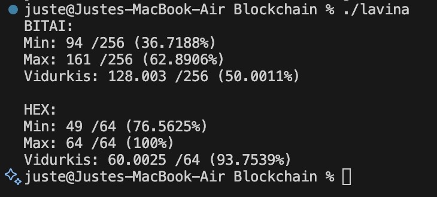
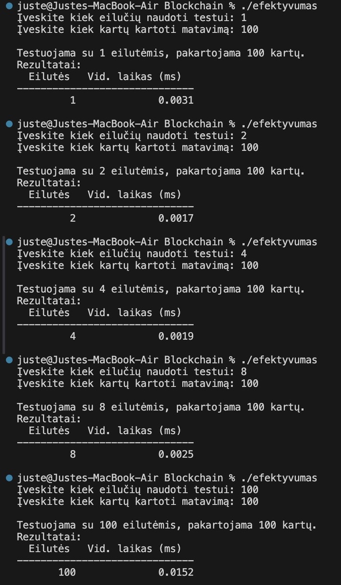
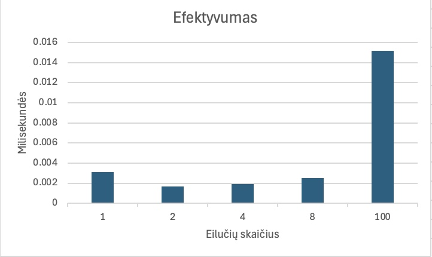
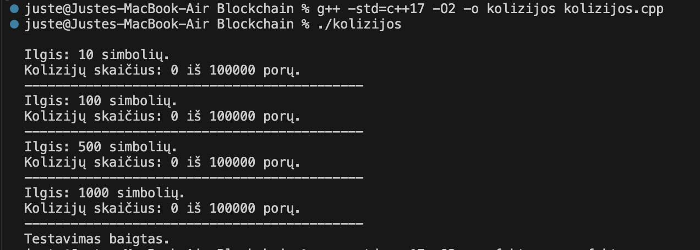
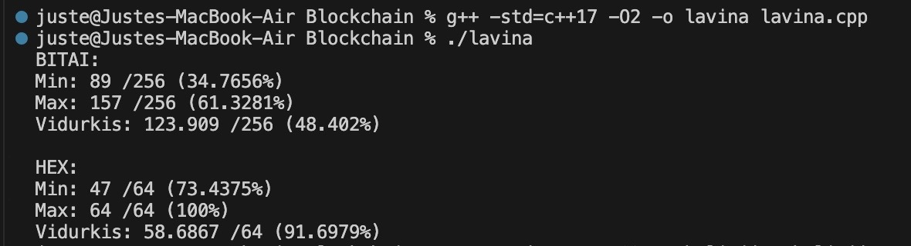
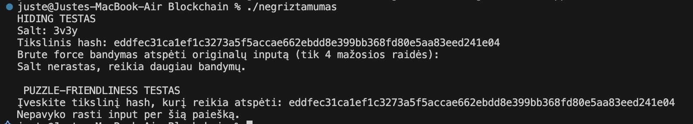

# Blockchain

# Palyginimas tarp sirtingų studentų hash'ų

# Efektyvumas

| Eilučių kiekis            | Augustės ir Astridos Hash | Benedikto ir Tauro Hash | Eligijaus ir Povilo Hash | Dominyko ir Marijaus Hash | Miglės Hash | Monikos Hash | Justes Hash | Nikitos Hash | Andriaus ir Valentino Hash | Nerijaus ir Igno Hash | Nikos ir Nastios Hash |
| :------------------------ | :-----------------------: | :---------------------: | :----------------------: | :-----------------------: | :---------: | :----------: | :---------: | :----------: | :------------------------: | :-------------------: | :-------------------: |
| 1 eilutė                  |         0.000003          |        0.000051         |         0.000042         |         0.001912          |  0.000072   |   0.000691   |  0.000003   |   0.000022   |          0.000000          |       0.000172        |       0.000000        |
| 2 eilutės                 |         0.000002          |        0.000044         |         0.000049         |         0.001764          |  0.000152   |   0.000672   |  0.000003   |   0.000017   |          0.000000          |       0.000187        |       0.000000        |
| 4 eilutės                 |         0.000003          |        0.000052         |         0.000054         |         0.001569          |  0.000397   |   0.001482   |  0.000002   |   0.000019   |          0.000000          |       0.000308        |       0.000000        |
| 8 eilutės                 |         0.000003          |        0.000068         |         0.000063         |         0.001557          |  0.001594   |   0.003564   |  0.000004   |   0.000024   |          0.000002          |       0.000564        |       0.001257        |
| 16 eilučių                |         0.000006          |        0.000081         |         0.000085         |         0.001572          |  0.002066   |   0.005757   |  0.000015   |   0.000065   |          0.000003          |       0.001078        |       0.000000        |
| 32 eilutės                |         0.000009          |        0.000094         |         0.000107         |         0.001690          |  0.004557   |   0.018003   |  0.000029   |   0.000081   |          0.000005          |       0.002669        |       0.001002        |
| 64 eilutės                |         0.000027          |        0.000127         |         0.000426         |         0.001922          |  0.006891   |   0.039891   |  0.000056   |   0.000163   |          0.000022          |       0.006254        |       0.002071        |
| 128 eilutės               |         0.000041          |        0.000341         |         0.000877         |         0.003004          |  0.008034   |   0.074522   |  0.000088   |   0.000399   |          0.000037          |       0.008936        |       0.004241        |
| 256 eilutės               |         0.000198          |        0.000602         |         0.001891         |         0.003646          |  0.010019   |   0.188049   |  0.000397   |   0.000995   |          0.000106          |       0.020262        |       0.010296        |
| 512 eilučių               |         0.000257          |        0.001296         |         0.005545         |         0.006413          |  0.012872   |   0.300145   |  0.000438   |   0.002834   |          0.000247          |       0.055744        |       0.023281        |
| Visas failas (789 eiltės) |         0.000378          |        0.002236         |         0.006541         |         0.007956          |  0.018226   |   0.334500   |  0.000512   |   0.004237   |          0.000545          |       0.087845        |       0.063517        |

# Atsparumas kolizijoms

| Vieno string poroje ilgis: | Augustės ir Astridos Hash | Benedikto ir Tauro Hash | Eligijaus ir Povilo Hash | Dominyko ir Marijaus Hash | Miglės Hash | Monikos Hash | Justes Hash | Nikitos Hash | Andriaus ir Valentino Hash | Nerijaus ir Igno Hash | Nikos ir Nastios Hash |
| :------------------------- | :-----------------------: | :---------------------: | :----------------------: | :-----------------------: | :---------: | :----------: | :---------: | :----------: | :------------------------: | :-------------------: | :-------------------: |
| 10                         |             0             |            0            |            0             |             0             |      0      |      0       |      0      |      0       |             0              |           0           |           0           |
| 100                        |             0             |            0            |            0             |             0             |      0      |      0       |      0      |      0       |             0              |           0           |           0           |
| 500                        |             0             |            0            |            0             |             0             |      0      |      0       |      0      |      0       |             0              |           0           |           0           |
| 1000                       |             0             |            0            |            0             |             0             |      0      |      0       |      0      |      0       |             0              |           0           |           0           |

# Lavinos efektas

Procentai rodo koks skirtumas yra tarp hash'ų (kuo didesnis procentas - tuo labiau skiriasi hash'ai).

#### BIT skirtumas

| Hash                       | Maksimalus skirtumas | Minimalus skirtumas | Vidutinis skirtumas |
| :------------------------- | :------------------: | :-----------------: | :-----------------: |
| Augustės ir Astridos Hash  |        84.69%        |        0.00%        |       49.56%        |
| Benedikto ir Tauro Hash    |        48.47%        |        0.84%        |       35.48%        |
| Eligijaus ir Povilo Hash   |        45.55%        |        1.45%        |       35.63%        |
| Dominyko ir Marijaus Hash  |        51.11%        |        42.9%        |       50.65%        |
| Miglės Hash                |        62.26%        |        0.55%        |       45.85%        |
| Monikos Hash               |        33.59%        |       11.32%        |       21.42%        |
| Justes Hash                |        97.65%        |       83.23%        |       91.82%        |
| Nikitos Hash               |        89.62%        |       34.19%        |       53.00%        |
| Andriaus ir Valentino Hash |        65.14%        |        9.33%        |       36.88%        |
| Nerijaus ir Igno Hash      |        63.41%        |       22.88%        |       49.84%        |
| Nikos ir Nastios Hash      |        67.97%        |       31.25%        |       50.00%        |

#### HEX skirtumas

| Hash                       | Maksimalus skirtumas | Minimalus skirtumas | Vidutinis skirtumas |
| :------------------------- | :------------------: | :-----------------: | :-----------------: |
| Augustės ir Astridos Hash  |       100.00%        |        2.54%        |       94.15%        |
| Benedikto ir Tauro Hash    |       100.00%        |        1.15%        |       82.13%        |
| Eligijaus ir Povilo Hash   |        96.00%        |        1.54%        |       75.73%        |
| Dominyko ir Marijaus Hash  |        97.88%        |       19.04%        |       93.71%        |
| Miglės Hash                |       100.00%        |        0.31%        |       85.92%        |
| Monikos Hash               |       100.00%        |       50.00%        |       81.45%        |
| Justes Hash                |        93.18%        |       76.61%        |       83.82%        |
| Nikitos Hash               |       100.00%        |        0.23%        |       86.13%        |
| Andriaus ir Valentino Hash |        64.45%        |       48.21%        |       92.74%        |
| Nerijaus ir Igno Hash      |       100.00%        |       45.00%        |       93.24%        |
| Nikos ir Nastios Hash      |       100.00%        |       68.75%        |       93.77%        |


------------------------------------------------------------------------------------------------------------------------------------


## Pagerintos versijos naudojant AI palyginimas su praeita
- tyrimų rezultatai tokie patys, tik lavinos efekto rezultatai kiek geresni:



------------------------------------------------------------------------------------------------------------------------------------


# Senosios versijos aprašymas ir rezultatai:

## Idėja:
- Turime keturias pradines būsenas (seed'us) 64 bitus (part0, part1, part2, part3). Kartu 256 bitai.
- For ciklu iteruojame per kiekvieną įvesties baitą ir maišome su pradinėmis būsenomis.
- Dar kartą for ciklu permaišom kiekvieną part su XOR ir padauginame iš hex 16 simbolių konstantos.
- Galiausiai sujungiame sumaišytas keturias dalis į vieną 256 bitų = 32 baitų = 64 hex formatu simbolių eilutę.

## Pseudokodas:
```
Pradžia
    Nustatyti keturias pradines reikšmes:
        part0 = 0x1234567890ABCDEF
        part1 = 0xFEDCBA0987654321
        part2 = 0x0F1E2D3C4B5A6978
        part3 = 0x89ABCDEF01234567

    Vartotojas įveda tekstą arba failo turinį kaip eilutę

    Kiekvienam įvesties simboliui:
        part0 = part0 + simbolio_reiksme
        part1 = part1 + part0 * 3
        part2 = part2 + part1 + (simbolio_reiksme * 7)
        part3 = part3 + part2 + (part0 * 2)

    Pakartojame 10 kartų:
        part0 = (part0 XOR (part1 * 3)) * 0x4E97B2D8F3C1A5E3
        part1 = (part1 XOR (part2 * 5)) * 0xA3D5F79C482EB16F
        part2 = (part2 XOR (part3 * 7)) * 0x5B18E4C7D92FA06E
        part3 = (part3 XOR (part0 * 9)) * 0xC74A9E21F05BD83C

    Paversti kiekvieną part į hex tekstą su 16 simbolių (užpildant nuliais, jei reikia)
    Sujungti visus 4 hex tekstus į vieną galutinį hash
    Išvesti hash
Pabaiga
```

## Paaiškinimai
- Seed'ai (part0..part3) – pradinės reikšmės.
- Iteracija per baitus – for (unsigned char b : input).
- part0 = part0 + b – tiesiog pridedame baitą prie part0.
- part1 = part1 + part0 * 3 – part0 padauginame iš 3, kad keistųsi baitai ir pridedame prie part1.
- part2 = part2 + part1 + (b * 7) – sujungiam ankstesnes vertes ir baitą padaugintą iš 7.
- part3 = part3 + part2 + (part0 * 2) – part0 padauginamas iš 2, sudedamos visos vertės, išskyrus part1.

- 10 kartų kartojame dar vieną maišymo ciklą.
- part0 maišomas su part1 (part1 padauginamas iš 3), po to viskas dauginama iš konstantos 0x4E97B2D8F3C1A5E3.
- part1 maišomas su part2 (×5), dauginama iš kitos konstantos.
- part2 maišomas su part3 (×7), dauginama iš trečios konstantos.
- part3 maišomas su part0 (×9), dauginama iš ketvirtos konstantos.
- Output – kiekvieną 64 bitų (16 hex simbolių) reikšmę atspausdiname su setw(16) + setfill('0'), todėl visada gauname 4×16 = 64 hex simbolius.


## Kompiliavimas
"g++ -std=c++17 -O2 -o hash hash.cpp"

## Paleidimas rankiniu būdu: 
"./hash" (programa prašys: Iveskite teksta:)

## Paleidimas duodant failą kaip argumentą: 
"./hash file.txt"


## Rezultatai
Išvedimo dydis:<br>
Failai su vienu simboliu:

64 simboliai - gerai<br>
Hash'ai skiriasi - gerai<br>
Praeitoje versijoje skyrėsi nedaug

Failai su 1000 simbolių (skiriasi 1 simboliu):

64 simboliai - gerai<br>
Hash'ai skiriasi - gerai<br>
Praeitoje versijoje skyrėsi nedaug

Tuščias failas

64 simboliai - gerai

Deterministiškumas:

Tas pats failas duoda tą patį hash'ą - gerai<br>
Taip pat ir praeitoje versijoje

Efektyvumas:<br>

<br>
Palyginus su praeita versija laikas labai panašus

Kolizijų paieška:<br>
<br>
Kolizijų nėra - gerai<br>
Taip pat ir praeitoje versijoje

Lavinos efektas:<br>
<br>
Didelis pokytis - gerai<br>
Praitoje versijoje pokytis daug mažesnis

Hiding ir puzzle-friendliness:<br>
<br>
Input ir salt neatkurti - gerai<br>
Taip pat ir praeitoje versijoje


Išvados:<br>
Visuomet išvedami 64 simboliai hex formatu, tas pats input duoda tą patį hashą, lavinos efektas įgyvendintas, kolizijų nerasta. Ši versija geresnė nei praeita.