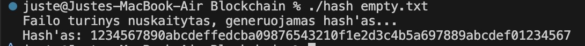
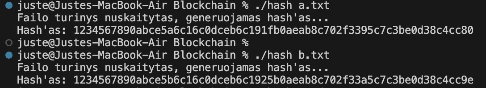
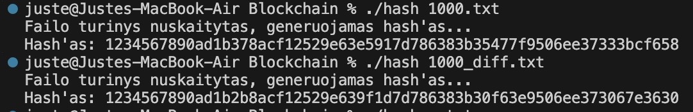
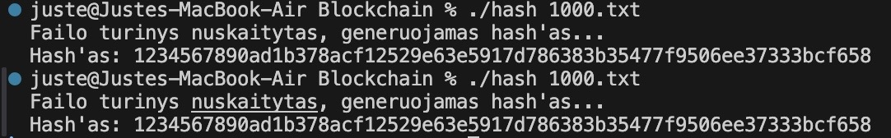

# Blockchain

## Idėja:
- Turime keturias pradines būsenas (seed'us) 64 bitus (part0, part1, part2, part3). Kartu 256 bitai.
- For ciklu iteruojame per kiekvieną įvesties baitą ir maišome su pradinėmis būsenomis.
- Galiausiai sujungiame sumaišytas keturias dalis į vieną 256 bitų = 32 baitų = 64 hex formatu simbolių eilutę.

## Pseudokodas:
Pradžia
    Nustatyti keturias pradines reikšmes:
        part0 = 0x1234567890ABCDEF
        part1 = 0xFEDCBA0987654321
        part2 = 0x0F1E2D3C4B5A6978
        part3 = 0x89ABCDEF01234567

    Vartotojas įveda tekstą arba failo turinį kaip eilutę

    Kiekvienam įvesties simboliui:
        part0 = part0 + simbolio_reiksme
        part1 = part1 + part0 * 3
        part2 = part2 + part1 + (simbolio_reiksme * 7)
        part3 = part3 + part2 + (part0 * 2)

    Paversti kiekvieną part į hex tekstą su 16 simbolių (užpildant nuliais)
    Sujungti visus 4 hex tekstus į vieną galutinį hash
    Išvesti hash
Pabaiga

## Paaiškinimai
- Seed'ai (part0..part3) – pradinės reikšmės.
- Iteracija per baitus – for (unsigned char b : input).
- part0 = part0 + b – tiesiog pridedame baitą prie part0.
- part1 = part1 + part0 * 3 – part0 padauginame iš 3, kad keistųsi baitai ir pridedame prie part1.
- part2 = part2 + part1 + (b * 7) – sujungiam ankstesnes vertes ir baitą padaugintą iš 7.
- part3 = part3 + part2 + (part0 << 1) – <<1 perstumia bitus į kairę per 1, sudedamos visos vertės išskyrus part1.
- Output – kiekvieną 64 bitų (16 hex simbolių) reikšmę atspausdiname su setw(16) + setfill('0'), todėl visada gauname 4×16 = 64 hex simbolius.

## Kompilaivimas
"g++ -std=c++17 -O2 -o hash hash.cpp"

## Paleidimas rankiniu būdu: 
"./hash" (programa prašys: Iveskite teksta:)

## Paleidimas duodant failą kaip argumentą: 
"./hash file.txt"

## Rezultatai
Išvedimo dydis: 
Failai su vienu simboliu:

64 simboliai - gerai 
hash'ai skiriasi, bet nestipriai

Failai su 1000 simbolių (skiriasi 1 simboliu):

64 simboliai - gerai 
hash'ai skiriasi, bet nestipriai

Tuščias failas

64 simboliai - gerai

Deterministiškumas:

Tas pats failas duoda tą patį hash'ą - gerai

Efektyvumas:

Kolizijų paieška:

Gerai, kolizijų nėra

Lavinos efektas:

Blogas