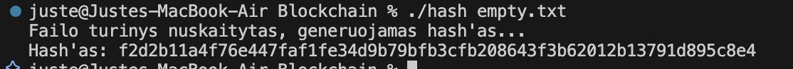

# Blockchain

## Idėja:
- Turime keturias pradines būsenas (seed'us) 64 bitus (part0, part1, part2, part3). Kartu 256 bitai.
- For ciklu iteruojame per kiekvieną įvesties baitą ir maišome su pradinėmis būsenomis.
- Dar kartą for ciklu permaišom kiekvieną part su XOR ir padauginame iš hex 16 simbolių konstantos.
- Galiausiai sujungiame sumaišytas keturias dalis į vieną 256 bitų = 32 baitų = 64 hex formatu simbolių eilutę.

## Pseudokodas:
Pradžia
    Nustatyti keturias pradines reikšmes:
        part0 = 0x1234567890ABCDEF
        part1 = 0xFEDCBA0987654321
        part2 = 0x0F1E2D3C4B5A6978
        part3 = 0x89ABCDEF01234567

    Vartotojas įveda tekstą arba failo turinį kaip eilutę

    Kiekvienam įvesties simboliui:
        part0 = part0 + simbolio_reiksme
        part1 = part1 + part0 * 3
        part2 = part2 + part1 + (simbolio_reiksme * 7)
        part3 = part3 + part2 + (part0 * 2)

    Pakartojame 10 kartų:
        part0 = (part0 XOR (part1 * 3)) * 0x4E97B2D8F3C1A5E3
        part1 = (part1 XOR (part2 * 5)) * 0xA3D5F79C482EB16F
        part2 = (part2 XOR (part3 * 7)) * 0x5B18E4C7D92FA06E
        part3 = (part3 XOR (part0 * 9)) * 0xC74A9E21F05BD83C

    Paversti kiekvieną part į hex tekstą su 16 simbolių (užpildant nuliais, jei reikia)
    Sujungti visus 4 hex tekstus į vieną galutinį hash
    Išvesti hash
Pabaiga

## Paaiškinimai
- Seed'ai (part0..part3) – pradinės reikšmės.
- Iteracija per baitus – for (unsigned char b : input).
- part0 = part0 + b – tiesiog pridedame baitą prie part0.
- part1 = part1 + part0 * 3 – part0 padauginame iš 3, kad keistųsi baitai ir pridedame prie part1.
- part2 = part2 + part1 + (b * 7) – sujungiam ankstesnes vertes ir baitą padaugintą iš 7.
- part3 = part3 + part2 + (part0 << 1) – <<1 perstumia bitus į kairę per 1, sudedamos visos vertės išskyrus part1.
- 10 kartų kartojame dar vieną maišymo ciklą.
- part0 maišomas su part1 (part1 padauginamas iš 3), po to viskas dauginama iš konstantos 0x4E97B2D8F3C1A5E3.
- part1 maišomas su part2 (×5), dauginama iš kitos konstantos.
- part2 maišomas su part3 (×7), dauginama iš trečios konstantos.
- part3 maišomas su part0 (×9), dauginama iš ketvirtos konstantos.
- Output – kiekvieną 64 bitų (16 hex simbolių) reikšmę atspausdiname su setw(16) + setfill('0'), todėl visada gauname 4×16 = 64 hex simbolius.

## Kompilaivimas
"g++ -std=c++17 -O2 -o hash hash.cpp"

## Paleidimas rankiniu būdu: 
"./hash" (programa prašys: Iveskite teksta:)

## Paleidimas duodant failą kaip argumentą: 
"./hash file.txt"

## Rezultatai
Išvedimo dydis: 
Failai su vienu simboliu:

64 simboliai - gerai 
hash'ai skiriasi - gerai

Failai su 1000 simbolių (skiriasi 1 simboliu):

64 simboliai - gerai 
hash'ai skiriasi - gerai

Tuščias failas

64 simboliai - gerai

Deterministiškumas:

Tas pats failas duoda tą patį hash'ą - gerai

Efektyvumas:

Kolizijų paieška: 
 
Kolizijų nėra - gerai

Lavinos efektas: 
 
Labai mažas pokytis - blogai

Hiding ir puzzle-friendliness: 
 
Input ir salt neatkurti - gerai